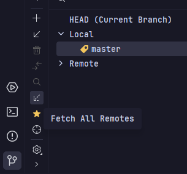
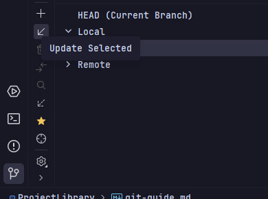
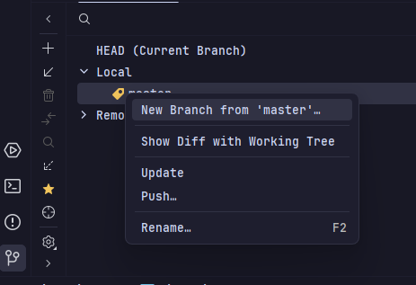
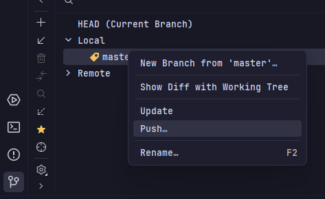
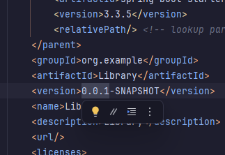

# Гайд на git

 - Скачать git можно по ссылке https://git-scm.com/downloads
 - Подключение к GitHub с помощью SSH https://docs.github.com/ru/authentication/connecting-to-github-with-ssh
 - Клонирование репозитория `git clone git@github.com:Resuwu/ProjectLibrary.git`
 - При выполнении задачи необходимо зафетчить (и если есть изменения запулить) ветку master, затем создать от него новую ветку и выполнить задачу в ней
 - Fetch

 - Pull

 - New branch

 - После выполнения задачи, необходимо закомитить изменения и запушить ветку
 - Push

 - Перед показом проделанной работы на паре, назначается один человек который будет собирать релизную сборку
 - Для этого нужно создать новую ветку от master с названием release-#.#.# (вместо решеток номер новой версии), замерджить в нее изменения, которые планируется в этот раз показать преподавателю, а также изменить номер версии в pom.xml

 - Проверить работоспособность приложения
 - Замерджить ветку релиза в master
 - Запушить релизную ветку и ветку master
 - (Опционально) Удалить ветки попавшие в релиз